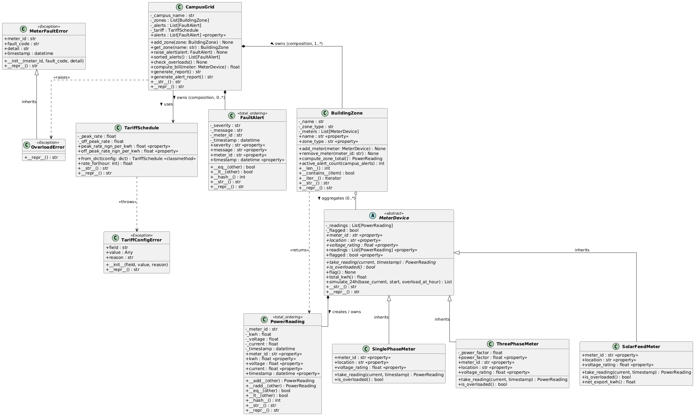

⁹# Smart Campus Power Management System

## 1. Project Title and Overview

The **Smart Campus Power Management System** is a Python OOP application that models the electricity monitoring infrastructure of a fictitious Nigerian university campus. Nigerian campuses face persistent challenges with erratic power supply, unmetered building consumption, and slow manual billing. This system addresses those challenges by tracking individual metered buildings (hostels, laboratories, lecture theatres, administrative blocks, and solar installations), computing electricity bills based on configurable peak and off-peak tariff schedules (06:00–22:00 peak; 22:00–06:00 off-peak), detecting consumption anomalies, raising priority-tiered fault alerts (CRITICAL / WARNING / INFO), and producing a campus-wide formatted power usage report. Every calculation traces back to an individual `PowerReading` snapshot, and every fault carries structured diagnostic information in a custom exception.

---

## 2. Team Members

| Full Name | Matric Number | GitHub Username |
|-----------|---------------|-----------------|
| Adeleye Omowumi Agnes | CPE/2023/1008 | @Omowumi513 |
| Adekunle Micheal Testimony| CPE/2023/1006 | @protocol238 |
| Adesoji PrincessDorcas| CPE/2023/1013 | adesojiprincess04 |
| [Member 4 Full Name] | FUOYE/2022/004 | @username4 |

---

## 3. OOP Concepts Demonstrated

| OOP Concept | Location in Code | Which Week |
|-------------|-----------------|------------|
| Classes & Objects with `__str__` and `__repr__` | All classes in `src/` | Week 1 |
| Separation of concerns — each class has one responsibility | `src/meters.py`, `src/tariff.py`, `src/campus_grid.py` | Week 1 |
| `@property` with validation (voltage, current, tariff rates) | `src/meters.py` (all meter subclasses), `src/tariff.py` | Week 2 |
| Private backing attributes (`_meter_id`, `_kwh`, `_peak_rate`) | `src/power_reading.py`, `src/tariff.py` | Week 2 |
| Custom exception hierarchy — `MeterFaultError`, `OverloadError`, `TariffConfigError` | `src/exceptions.py` | Week 2 |
| Structured exception fields (`meter_id`, `fault_code`, `detail`, `timestamp`) | `src/exceptions.py`, lines 10–20 | Week 2 |
| Abstract Base Class `MeterDevice` with `@abstractmethod` | `src/meters.py`, class `MeterDevice` | Week 3 |
| Single inheritance — `SinglePhaseMeter`, `ThreePhaseMeter`, `SolarFeedMeter` all extend `MeterDevice` | `src/meters.py` | Week 3 |
| `super().__init__()` cooperative constructor call | `src/meters.py`, all three concrete meter classes | Week 3 |
| Abstract properties enforcing contract on subclasses | `src/meters.py`, `MeterDevice.meter_id`, `.location`, `.voltage_rating` | Week 3 |
| `@total_ordering` for full comparison protocol from two methods | `src/power_reading.py`, `src/fault_alert.py` | Week 4 |
| `__add__` and `__radd__` enabling `sum(meter.readings)` | `src/power_reading.py`, lines 62–87 | Week 4 |
| `__len__`, `__contains__`, `__iter__` on `BuildingZone` | `src/building_zone.py`, lines 78–95 | Week 4 |
| Polymorphic `generate_report()` using duck typing (no `isinstance`) | `src/campus_grid.py`, `CampusGrid.generate_report()` | Week 4 |
| Operator overloading `__eq__`, `__lt__`, `__hash__` | `src/power_reading.py`, `src/fault_alert.py` | Week 4 |
| UML class diagram with all 6 relationship types | `uml/class_diagram.puml` | Week 5 |

---

## 4. System Architecture



The system is structured around a clear ownership hierarchy. `CampusGrid` sits at the top and **owns** (composition) a list of `BuildingZone` objects and a list of `FaultAlert` objects — both are created inside the grid and have no meaningful existence outside it. Each `BuildingZone` **aggregates** (hollow diamond) multiple `MeterDevice` instances, meaning meters are created independently and passed in; they can be moved between zones without being destroyed.

`MeterDevice` is an abstract base class that **composes** `PowerReading` objects — every `take_reading()` call creates a new immutable `PowerReading` and stores it in the meter's private `_readings` list. The three concrete meter types (`SinglePhaseMeter`, `ThreePhaseMeter`, `SolarFeedMeter`) all **inherit** from `MeterDevice`, each implementing the required abstract methods with their own power formulae (P = V × I for single-phase; P = √3 × V × I × PF for three-phase; signed readings for solar).

`CampusGrid` **uses** (dependency) `TariffSchedule` to compute bills — it holds a reference to a tariff object but does not own its lifecycle. `OverloadError` is raised (dependency arrow) by `CampusGrid.check_overloads()` when a meter's current reading exceeds 150% of its rated capacity.

**Composition vs aggregation key decision:** `BuildingZone` aggregates meters rather than composing them because the same physical meter device (with its full reading history) might be reassigned to a different zone during campus restructuring. If we used composition, removing a zone would delete the meter's data. Aggregation preserves that independence.

---

## 5. How to Run

```bash
# 1. Clone the repository
git clone https://github.com/<your-org>/smart_campus_power.git
cd smart_campus_power

# 2. Create and activate a virtual environment
python -m venv venv
# Windows:
venv\Scripts\activate
# macOS / Linux:
source venv/bin/activate

# 3. Install dependencies
pip install -r requirements.txt

# 4. Run the full demo
python main.py

# 5. Run the test suite
pytest tests/ -v
```

---

## 6. Sample Output

```
============================================================
  SMART CAMPUS POWER MANAGEMENT SYSTEM
  Federal University Oye-Ekiti — Campus Grid Demo
============================================================

Tariff loaded: TariffSchedule(peak=NGN 68.00/kWh, off-peak=NGN 45.00/kWh)

[Simulating 15 hourly readings per meter ...]
[Checking for overloads ...]

================================================================
  CAMPUS POWER REPORT — Federal University Oye-Ekiti
================================================================
Zone                           Total kWh      Bill (NGN)  Alerts
----------------------------------------------------------------
Male & Female Hostels              38.98        2,317.71       1
Science Laboratories              252.34       20,953.22       0
Administration Block               10.35          608.58       1
Lecture Theatres                  146.64       12,071.03       1
Solar Generation                  -10.12         -735.77       0
----------------------------------------------------------------
CAMPUS TOTAL                      438.19       35,214.77       3
================================================================

--- ACTIVE ALERTS (sorted by severity) ---
[CRITICAL] 2026-06-20 14:00 | SPM-001 | Overload detected: 18.00 A exceeds rated capacity on Male Hostel Block A
[WARNING] 2026-06-20 08:00 | SPM-003 | Voltage sag detected — possible supply instability
[INFO] 2026-06-20 06:00 | TPM-003 | Routine maintenance scheduled 22:00–00:00
Total alerts: 3

Solar net export to grid: 10.120 kWh

Top 3 highest readings from Physics Lab:
  PowerReading(TPM-001 | 21.384 kWh | 415.0 V | 35.00 A | 2026-06-20 10:00)
  PowerReading(TPM-001 | 7.332 kWh | 415.0 V | 12.00 A | 2026-06-20 00:00)
  PowerReading(TPM-001 | 7.332 kWh | 415.0 V | 12.00 A | 2026-06-20 01:00)

Total kWh for Male Hostel Block A: 23.460 kWh

--- Exception demos ---
Caught: TariffConfigError: peak_rate_ngn_per_kwh=-10 — must be a positive number
Caught: [SPM-001] Fault OVL-001: Current 18 A exceeds 150% of 10 A rating

Demo complete.
```

---

## 7. Known Limitations

- **No real network communication:** The system models power readings using in-memory Python objects. Real SCADA/IoT integration (serial ports, MQTT, REST APIs) is out of scope.
- **Simulated timestamps only:** The `simulate_24h()` helper generates synthetic hourly timestamps starting from a fixed `datetime`. Real deployments would pull timestamps from hardware meters.
- **Fixed overload threshold:** The overload threshold is hardcoded at 10 A (single-phase) and 20 A (three-phase) as nominal design limits. A production system would read the rated capacity from meter configuration data.
- **No data persistence:** All meter readings and alerts are held in memory and lost when the program exits. A real system would write to a database.
- **Single-day simulation:** The demo only simulates one 24-hour period (15 hourly readings). Multi-day historical analysis is not implemented.

---

## 8. References

- Python Documentation — `abc` module: https://docs.python.org/3/library/abc.html
- Python Documentation — `functools.total_ordering`: https://docs.python.org/3/library/functools.html#functools.total_ordering
- Python Documentation — Data Model (dunder methods): https://docs.python.org/3/reference/datamodel.html
- IEEE Std 1459-2010 — Definitions for the Measurement of Electric Power Quantities
- Three-Phase Power Formula Reference — P = √3 × V × I × cos(φ)
- Nigerian Electricity Regulatory Commission (NERC) Tariff Order 2024
- PlantUML Reference Guide: https://plantuml.com/class-diagram
- pytest Documentation: https://docs.pytest.org/en/stable/
